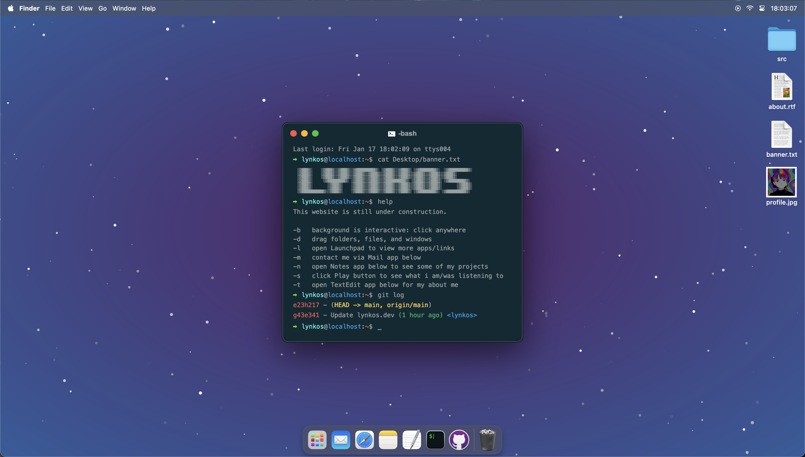
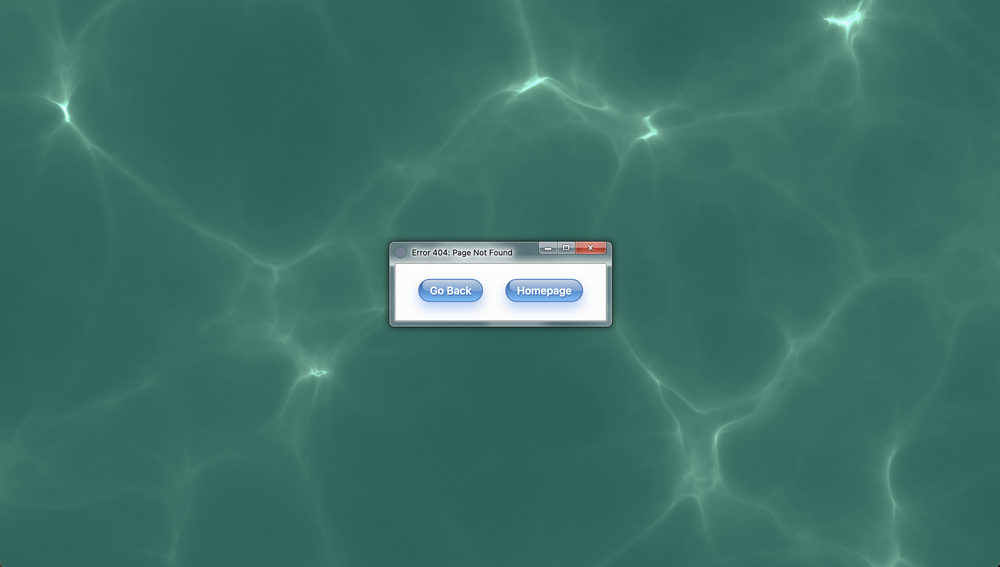
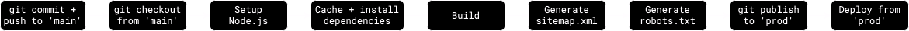

<div align="center">
   <h1><a target="_blank" href="https://lynkos.dev" alt="lynkos.dev">lynkos.github.io</a></h1>
    
    
    
    
    
    
    
    
    
    
    
    
    
    
    <br>
    
    
    <a title="GitHub License" href="LICENSE.md"></a>
   <p>macOS Sequoia-inspired personal website.</p>
</div>

<details open>
  <summary><a title="Home Page" href="https://lynkos.dev">Home Page</a></summary>
  <div align="center">
    <figure>
      <picture></picture>
    </figure>
  </div>
</details>

<details open>
  <summary><a title="404 Error Page" href="https://lynkos.dev/404">404 Error Page</a></summary>
  <div align="center">
    <figure>
      <picture></picture>
    </figure>
  </div>
</details>

## Features
> [!NOTE]
> Additional features are still in development
> 
> Current features are actively being optimized and improved

Includes (but is not limited to):
* **Mail**
  * Send me an email directly, without leaving the site!
  * Includes reCAPTCHA to prevent spam
  * Your email and message are required
  * Subject is optional
* **iTerm**
  * `help`, `ls`, and `clear` commands are supported (doesn't work on mobile devices)
  * Timestamp (i.e. displays date and time when site is loaded)
* **Safari**
  * Click on any skill to toggle its description
  * Interactive address bar
* **Notes**
  * View various projects in sidebar
* **TextEdit**
  * Font family, size, color, and line-height can be changed
  * Font alignment (i.e. left, center, right, justify) can be changed
  * Font style (i.e. bold, italic, underline) can be changed
* **Launchpad**
  * Apps are draggable/reorderable
  * Apps are searchable (i.e. type in searchbar to filter)
* **Calculator**
  * Fully functional calculator
  * Supports basic arithmetic operations, including:
    * Addition (**+**)
    * Subtraction (**−**)
    * Multiplication (**×**)
    * Division (**÷**)
    * Modulus (**%**)
* **Preview**
  * Previewed image can be rotated, zoomed into, and zoomed out of
* **Menubar**
  * Real-time **Clock** (i.e. displays date and time)
  * Click the play icon in the upper-right corner of the menubar to open **Music Player** and see what I am/was listening to
* **Dock**
  * Clicking/opening any unopened app produces a bouncing effect
* **Desktop**
  * `src`, `about.rtf`, `banner.txt`, and `profile.jpg` are all draggable
  * Double-click (or tap, if on mobile) `about.rtf` or `profile.jpg` to open **TextEdit** or **Preview**, respectively
* **Trash**
  * Clicking the trash icon in the dock opens an "Empty Trash" dialog
  * Clicking "Empty Trash" button will empty the trash (i.e. replace the trash icon with an empty trash icon and produce a sound effect)
* Resizable and movable windows

## Requirements
- [x] [npm](https://docs.npmjs.com/getting-started)
- [x] [Node.js](https://nodejs.org/en/download)

## Installation
1. Enter directory where you want to clone repository (`lynkos.github.io`)
    * UNIX
        ```sh
        cd ~/path/to/directory
        ```
    * Windows
        ```sh
        cd C:\path\to\directory
        ```
2. Clone and enter repository
    ```sh
    git clone https://github.com/lynkos/lynkos.github.io.git && cd lynkos.github.io
    ```
3. Install dependencies
    ```sh
    npm install
    ```

## Usage
### Start Development Environment
 ```sh
 npm run dev
 ```

### Build Project
 ```sh
 npm run build
 ```

## Miscellaneous
### Deployment Pipeline
> [!NOTE]
> Refer to [`gh-pages.yml`](.github/workflows/gh-pages.yml) for full workflow



### Initial Deployment Setup
> [!IMPORTANT]
> This subsection is **only applicable** if you are deploying to **GitHub Pages**

1. Create `prod` branch (if you haven't already)
2. Generate SSH key
   ```sh
   ssh-keygen -t ed25519 -C "$(git config user.email)" -f gh-pages -N ""
   ```
3. Go to your repository's "Deploy keys" settings (i.e. https://github.com/YOUR_USERNAME/REPOSITORY_NAME/settings/keys)
4. Click "Add deploy key"
5. Enter `ACTIONS_DEPLOY_KEY` in "Title" field and paste contents of generated public key (i.e. `gh-pages.pub`) in "Key" field
6. Check "Allow write access"
7. Click "Add key"
8. Go to your repository's "Actions secrets and variables" settings (i.e. https://github.com/YOUR_USERNAME/REPOSITORY_NAME/settings/secrets/actions)
9. Click "New repository secret"
10. Enter `ACTIONS_DEPLOY_KEY` in "Name" field and paste contents of generated private key (i.e. `gh-pages`) in "Secret" field
11. Click "Add secret"
12. Go to your repository's "Pages" settings (i.e. https://github.com/YOUR_USERNAME/REPOSITORY_NAME/settings/pages)
13. Under "Build and deployment", select the following:
    * **Source**: "Deploy from a branch"
    * **Branch**: `prod` and `/ (root)`
14. Click "Save"
15. Make sure that it now says "Your GitHub Pages site is currently being built from the `prod` branch" under "Branch"

### Custom Email Form
Any message submitted via the Mail form will be sent to *my* email. In order to customize it so that it can be sent to your email, you will have to:

1. [Follow the steps in this GitHub repo](https://github.com/dwyl/learn-to-send-email-via-google-script-html-no-server)
2. Modify the code within [`<form class="gform">`](https://github.com/lynkos/lynkos.github.io/blob/a4893c3fd85cea5fb716dd63ae8d0e519bd2661e/index.html#L491) (inclusive) in [`index.html`](index.html) accordingly

### Repository Structure
> [!NOTE]
> [`main`](https://github.com/lynkos/lynkos.github.io/tree/main) is used for development

<details open>
  <summary><a title="Main branch" href="https://github.com/lynkos/lynkos.github.io/tree/main"><code>main</code></a> branch</summary>
  <pre>.
├── .github/
│   ├── workflows/
│   │   └── gh-pages.yml
│   └── dependabot.yml
├── assets/
│   ├── audio/
│   │   └── empty_trash.mp3
│   ├── favicon/
│   │   ├── apple-touch-icon.png
│   │   ├── favicon-96x96.png
│   │   ├── favicon.ico
│   │   ├── favicon.svg
│   │   ├── site.webmanifest
│   │   ├── web-app-manifest-192x192.png
│   │   └── web-app-manifest-512x512.png
│   ├── images/
│   │   ├── apps/
│   │   │   ├── calc.png
│   │   │   ├── discord.png
│   │   │   ├── github.svg
│   │   │   ├── iterm.png
│   │   │   ├── launchpad.png
│   │   │   ├── mail.png
│   │   │   ├── notes.png
│   │   │   ├── preview.png
│   │   │   ├── safari.png
│   │   │   ├── spotify.png
│   │   │   ├── steam.png
│   │   │   └── text_edit.png
│   │   ├── icons/
│   │   │   ├── angles-up-down.svg
│   │   │   ├── control_center.svg
│   │   │   └── terminal.svg
│   │   ├── misc/
│   │   │   ├── 404.png
│   │   │   ├── demo.png
│   │   │   ├── mpc.jpg
│   │   │   ├── pipeline.png
│   │   │   └── profile.jpg
│   │   └── system/
│   │       ├── blue_folder.png
│   │       ├── empty_trash.png
│   │       ├── rtf_icon.png
│   │       ├── text_file.png
│   │       └── trash.png
│   └── stylesheets/
│       └── sass/
│           ├── _mixins.sass
│           ├── _variables.sass
│           ├── 404.sass
│           ├── browser.sass
│           ├── calculator.sass
│           ├── dock.sass
│           ├── launchpad.sass
│           ├── mail.sass
│           ├── menubar.sass
│           ├── notes.sass
│           ├── preview.sass
│           ├── style.sass
│           ├── terminal.sass
│           ├── text-edit.sass
│           └── tooltip.sass
├── src/
│   ├── components/
│   │   ├── 404.js
│   │   ├── calculator.js
│   │   ├── email.js
│   │   ├── terminal.js
│   │   └── windows.js
│   └── utilities/
│       ├── particles.js
│       └── timestamp.js
├── .gitignore
├── 404.html
├── index.html
├── LICENSE.md
├── package-lock.json
├── package.json
└── README.md</pre>
</details>
<br>

> [!NOTE]
> [`prod`](https://github.com/lynkos/lynkos.github.io/tree/prod) is used for production

<details open>
  <summary><a title="Prod branch" href="https://github.com/lynkos/lynkos.github.io/tree/prod"><code>prod</code></a> branch</summary>
  <pre>.
├── assets/
│   ├── audio/
│   │   └── empty_trash.mp3
│   ├── favicon/
│   │   ├── apple-touch-icon.png
│   │   ├── favicon-96x96.png
│   │   ├── favicon.ico
│   │   ├── favicon.svg
│   │   ├── site.webmanifest
│   │   ├── web-app-manifest-192x192.png
│   │   └── web-app-manifest-512x512.png
│   ├── images/
│   │   ├── apps/
│   │   │   ├── calc.png
│   │   │   ├── discord.png
│   │   │   ├── github.svg
│   │   │   ├── iterm.png
│   │   │   ├── launchpad.png
│   │   │   ├── mail.png
│   │   │   ├── notes.png
│   │   │   ├── preview.png
│   │   │   ├── safari.png
│   │   │   ├── spotify.png
│   │   │   ├── steam.png
│   │   │   └── text_edit.png
│   │   ├── icons/
│   │   │   ├── angles-up-down.svg
│   │   │   ├── control_center.svg
│   │   │   └── terminal.svg
│   │   ├── misc/
│   │   │   ├── 404.png
│   │   │   ├── demo.png
│   │   │   ├── mpc.jpg
│   │   │   └── profile.jpg
│   │   └── system/
│   │       ├── blue_folder.png
│   │       ├── empty_trash.png
│   │       ├── rtf_icon.png
│   │       ├── text_file.png
│   │       └── trash.png
│   └── stylesheets/
│       └── css/
│           ├── 404.css
│           ├── browser.css
│           ├── calculator.css
│           ├── dock.css
│           ├── launchpad.css
│           ├── mail.css
│           ├── menubar.css
│           ├── notes.css
│           ├── preview.css
│           ├── style.css
│           ├── terminal.css
│           ├── text-edit.css
│           └── tooltip.css
├── dist/
│   ├── components/
│   │   ├── 404.js
│   │   ├── calculator.js
│   │   ├── email.js
│   │   ├── terminal.js
│   │   └── windows.js
│   └── utilities/
│       ├── particles.js
│       └── timestamp.js
├── 404.html
├── CNAME
├── index.html
├── robots.txt
└── sitemap.xml</pre>
</details>

## Resources
* [`actions-gh-pages`](https://github.com/peaceiris/actions-gh-pages)
* [Deploy keys (SSH)](https://docs.github.com/en/authentication/connecting-to-github-with-ssh/managing-deploy-keys#deploy-keys)
* [Creating a branch within your repository](https://docs.github.com/en/pull-requests/collaborating-with-pull-requests/proposing-changes-to-your-work-with-pull-requests/creating-and-deleting-branches-within-your-repository#creating-a-branch)
* [GitHub Pages Action](https://github.com/marketplace/actions/github-pages-action)
* [GitHub Actions: Deploy Pages](https://github.com/actions/deploy-pages)
* [Using custom workflows with GitHub Pages](https://docs.github.com/en/pages/getting-started-with-github-pages/using-custom-workflows-with-github-pages)
* [Configuring a publishing source for your GitHub Pages site](https://docs.github.com/en/pages/getting-started-with-github-pages/configuring-a-publishing-source-for-your-github-pages-site)
* [Writing workflows](https://docs.github.com/en/actions/writing-workflows)
* [Send Email from a *Static* HTML Form using Google Apps Mail!](https://github.com/dwyl/learn-to-send-email-via-google-script-html-no-server)
* [Deploy Nuxt on GitHub Pages](https://v2.nuxt.com/deployments/github-pages)
* [Node Version Manager (NVM): GitHub Repository](https://github.com/nvm-sh/nvm)
* [GitHub Actions: Cache](https://github.com/actions/cache)
* [Set up Sass in the best way](https://remybeumier.be/blog/set-up-sass-in-the-best-way)
