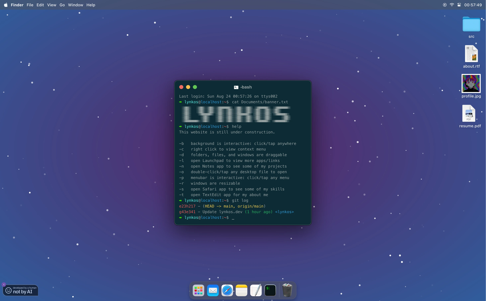

<div align="center">
   <h1><a target="_blank" href="https://lynkos.dev" alt="lynkos.dev">lynkos.github.io</a></h1>
    
    
    
    
    
    
    
    
    
    
    
    
    
    
    
    <br>
    
    
    <a title="GitHub License" href="LICENSE.md"></a>
    <a target="_blank" href="https://deepwiki.com/lynkos/lynkos.github.io" title="DeepWiki for lynkos/lynkos.github.io repository"></a>
   <p>Personal website inspired by macOS Sequoia and macOS Sonoma.</p>
</div>

<details open>
  <summary><a title="Home Page" href="https://lynkos.dev">Home Page</a></summary>
  <div align="center">
    <figure>
      <picture></picture>
    </figure>
  </div>
</details>

<details open>
  <summary><a title="404 Error Page" href="https://lynkos.dev/404">404 Error Page</a></summary>
  <div align="center">
    <figure>
      <picture></picture>
    </figure>
  </div>
</details>

## Features
> [!IMPORTANT]
> **Mail** app (aka email functionality aka contact form) is currently disabled and will be re-enabled after I troubleshoot, debug, + fix the server-side script
> 
> Additional features are still in development
> 
> Current features are actively being optimized and improved

Includes (but is not limited to):
* Resizable and movable windows
  * Supported on both desktop and mobile
  * Click red button in upper-left corner to close window
  * Click green button in upper-left corner to maximize window
* ~~**Mail**~~
  * ~~Send me an email directly, without leaving the site!~~
  * ~~Includes reCAPTCHA to prevent spam~~
  * ~~Your email and message are required~~
  * ~~Subject is optional~~
* **iTerm**
  * Inspired by terminal (specifically iTerm)
  * Timestamp (i.e. displays date and time when site is loaded)
* **Safari**
  * Click on any skill to toggle its description
  * Interactive address bar
* **Notes**
  * View various projects in sidebar
* **TextEdit**
  * Font family, size, color, and line-height can be changed
  * Font alignment (i.e. left, center, right, justify) can be changed
  * Font style (i.e. bold, italic, underline) can be changed
* **Launchpad**
  * Apps are draggable/reorderable
  * Apps are searchable (i.e. type in searchbar to filter)
* **Calculator**
  * Functional calculator
  * Supports basic arithmetic operations, including:
    * Addition (**+**)
    * Subtraction (**−**)
    * Multiplication (**×**)
    * Division (**÷**)
    * Modulus (**%**)
* **Menubar**
  * Real-time **Clock** (i.e. displays date and time)
  * Click the play icon in the upper-right corner of the menubar to open **Music Player** and see what I am/was listening to
  * Click the WiFi icon in the upper-right corner of the menubar to open WiFi menu
  * Click any of the tabs in the upper-left corner of the menubar to open its respective dropdown
* **Desktop**
  * `src`, `about.rtf`, [`profile.jpg`](assets/img/misc/profile.webp), and [`resume.pdf`](assets/resume.pdf) icons are all draggable
  * Double-click (or tap, if on mobile) `about.rtf` to open **TextEdit** (i.e. my about me)
  * Double-click (or tap, if on mobile) [`profile.jpg`](assets/img/misc/profile.webp) or [`resume.pdf`](assets/resume.pdf) to open **Preview**
* **Preview**
  * View my resume (i.e. [`resume.pdf`](assets/resume.pdf))
  * View my profile picture (i.e. [`profile.jpg`](assets/img/misc/profile.webp))
  * Previewed image can be rotated, zoomed into, and zoomed out of
* **Trash**
  * Clicking the trash icon in the dock opens an "Empty Trash" dialog
  * Clicking "Empty Trash" button will empty the trash (i.e. replace the trash icon with an empty trash icon and produce a sound effect)
* **Dock**
  * Clicking/opening any unopened app produces a bouncing effect
* **Context Menu**
  * Right-click anywhere (except menubar) to open context menu
  * Desktop only; not supported on mobile
* **Cursors**
  * Default: Default cursor
  * Pointer: Hover over links
  * Text: Hover over input fields
  * Crosshair: Hover over preview image

## Requirements
- [x] [npm](https://docs.npmjs.com/getting-started)
- [x] [Node.js](https://nodejs.org/en/download)

## Installation
1. Enter directory where you want to clone repository (`lynkos.github.io`)
    * UNIX
        ```sh
        cd ~/path/to/directory
        ```
    * Windows
        ```sh
        cd C:\path\to\directory
        ```
2. Only clone `main` branch (to avoid cloning unneeded branches) from repository
    ```sh
    git clone --single-branch -b main https://github.com/lynkos/lynkos.github.io.git
    ```
3. Enter repository
    ```sh
    cd lynkos.github.io
    ```
4. Install dependencies
    ```sh
    npm install
    ```

## Usage
### Start Development Environment
 ```sh
 npm run dev
 ```

### Build Environment
 ```sh
 npm run build
 ```

### Deploy to Production
> [!NOTE]
> Refer to [`gh-pages.yml`](.github/workflows/gh-pages.yml) for full workflow and [`package.json`](package.json) for [build script](package.json#L9) (i.e. `npm run build`)


#### Initial Setup
1. Create `prod` branch
    ```sh
    git checkout -b prod
    ```
2. Push `prod` branch to remote (i.e. GitHub)
    ```sh
    git push -u origin prod
    ```
3. Generate SSH key
   ```sh
   ssh-keygen -t ed25519 -C "$(git config user.email)" -f gh-pages -N ""
   ```
4. Go to your repository's **Deploy keys** settings (i.e. https://github.com/YOUR_USERNAME/REPOSITORY_NAME/settings/keys)
5. Click **Add deploy key**
6. Enter `ACTIONS_DEPLOY_KEY` in **Title** field and paste contents of generated public key (i.e. `gh-pages.pub`) in **Key** field
7. Check **Allow write access**
8. Click **Add key**
9. Go to your repository's **Actions secrets and variables** settings (i.e. https://github.com/YOUR_USERNAME/REPOSITORY_NAME/settings/secrets/actions)
10. Click **New repository secret**
11. Enter `ACTIONS_DEPLOY_KEY` in **Name** field and paste contents of generated private key (i.e. `gh-pages`) in **Secret** field
12. Click **Add secret**
13. Go to your repository's **Pages** settings (i.e. https://github.com/YOUR_USERNAME/REPOSITORY_NAME/settings/pages)
14. Under **Build and deployment**, select the following:
    * **Source**: Deploy from a branch
    * **Branch**: `prod` and `/ (root)`
15. Click **Save**
16. Make sure that it now says "Your GitHub Pages site is currently being built from the `prod` branch" under **Branch**

## Appendix
### Custom Email Form
> [!NOTE]
> Any message submitted via the Mail form will be sent to *my* email.
>
> Follow this section to use your email with the Mail form.

1. Complete the steps in [this GitHub repo](https://github.com/dwyl/learn-to-send-email-via-google-script-html-no-server)'s [`README` doc](https://github.com/dwyl/learn-to-send-email-via-google-script-html-no-server/blob/master/README.md)
   * You will need to create a new Google Apps Script project and publish it as a web app
2. Use your own [reCAPTCHA v2](https://developers.google.com/recaptcha/docs/display#auto_render) widget and replace [`data-sitekey`](index.html#L913) in [`index.html`](index.html) with your own sitekey
   * You can opt out of and remove reCAPTCHA v2 by making some changes to both [`index.html`](index.html) and [`email.js`](src/components/email.js)
   * Note that removing reCAPTCHA v2 widget **WILL** result in a daily influx of bot/spam messages (assuming you've successfully completed Step #1)
3. Modify the code within [`<form class="gform">`](index.html#L905) (inclusive) in [`index.html`](index.html) accordingly

### Resources
* [`actions-gh-pages`](https://github.com/peaceiris/actions-gh-pages)
* [Deploy keys (SSH)](https://docs.github.com/en/authentication/connecting-to-github-with-ssh/managing-deploy-keys#deploy-keys)
* [Creating a branch within your repository](https://docs.github.com/en/pull-requests/collaborating-with-pull-requests/proposing-changes-to-your-work-with-pull-requests/creating-and-deleting-branches-within-your-repository#creating-a-branch)
* [GitHub Pages Action](https://github.com/marketplace/actions/github-pages-action)
* [GitHub Actions: Deploy Pages](https://github.com/actions/deploy-pages)
* [Using custom workflows with GitHub Pages](https://docs.github.com/en/pages/getting-started-with-github-pages/using-custom-workflows-with-github-pages)
* [Configuring a publishing source for your GitHub Pages site](https://docs.github.com/en/pages/getting-started-with-github-pages/configuring-a-publishing-source-for-your-github-pages-site)
* [Writing workflows](https://docs.github.com/en/actions/writing-workflows)
* [Send Email from a *Static* HTML Form using Google Apps Mail!](https://github.com/dwyl/learn-to-send-email-via-google-script-html-no-server)
* [Deploy Nuxt on GitHub Pages](https://v2.nuxt.com/deployments/github-pages)
* [Node Version Manager (NVM): GitHub Repository](https://github.com/nvm-sh/nvm)
* [GitHub Actions: Cache](https://github.com/actions/cache)
* [Set up Sass in the best way](https://remybeumier.be/blog/set-up-sass-in-the-best-way)
* [Automatically render reCAPTCHA v2 widget](https://developers.google.com/recaptcha/docs/display#auto_render)
* [Improve page performance lazy loading reCaptcha](https://dev.to/uf4no/improve-page-performance-lazy-loading-recaptcha-442o)